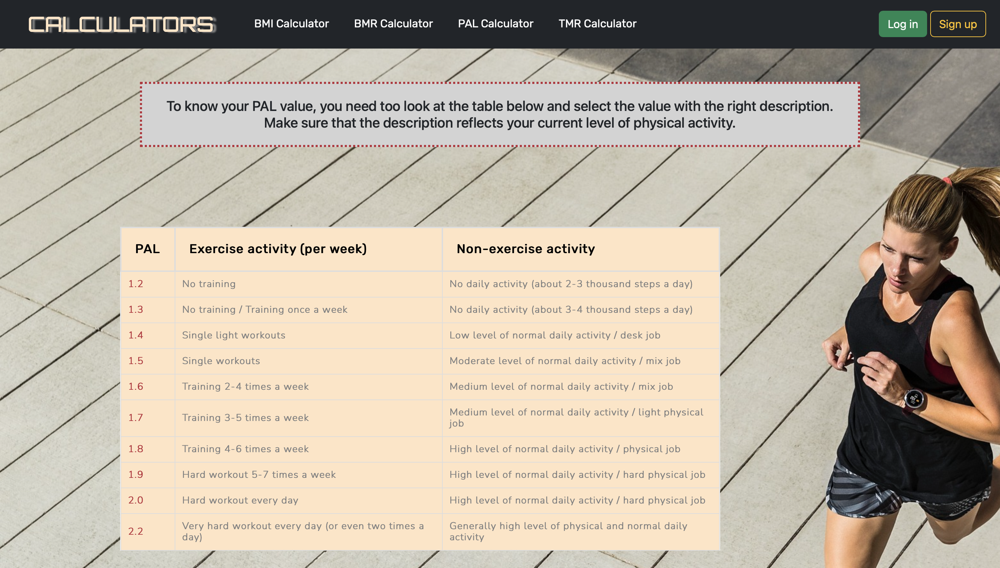

# :balance_scale: BMI Calculator

The website provides a set of basic functional calculators, including:
<br /><br />
* :standing_man: **BMI calculator** - Body Mass Index
* :lotus_position_woman: **BMR calculator** - Basal Metabolic Rate
* :weight_lifting_man: **PAL calculator** - Physical Activity Level
* :running_woman: **TMR calculator** - Total Metabolic Rate
<br />
The project allows users to save their data (like current BMI value) for future reference, which can particularly useful especially during weight loss or weight gain journeys.

## Overview
Honestly despite my interests in healthy lifestyle, I have never seen a website that offers all these useful and essential calculators.

All these calculators are so helpful in losing / gaining / maintaining weight so I decided to bring them all together and create a comprehensive website with each useful tool. 

The website is designed to be clear user-friendly. I've also put some effort to providing additional verified and effective information.

## Requirements

**Python 3.0** or any higher version


## Installation
<strong>1. Clone the repo and navigate to the project directory:</strong>
<br />

```bash
  git clone https://github.com/Nagu0804/BMICalculator.git
```
<br />
<strong>2. If you want to create the virtual environment particularly for that project and connect with it:</strong>

```bash
  python3 -m venv venv
```
```bash
  venv\Scripts\activate # on Windows
  source venv/bin/activate # on MacOS/Unix
```
<br />
<strong>3. Change to the project directory:</strong>

```bash
  cd BMICalculator
```
<br />
<strong>4. Install the required dependencies:</strong>

```bash
  pip3 install -r requirements.txt
```
<br />
<strong>5. Create a ".env" file and place the following code in it. Generate your own unique secret key and replace the key provided in the below code. Also, change the value of DEBUG to "True" or "False":</strong>


<br />
<strong>6. Apply migrations to initialize the database:</strong>

```bash
  python3 manage.py migrate
```
<br />
<strong>7. Create a superuser to access the admin panel</strong>

```bash
  python3 manage.py createsuperuser
```
<br />
<strong>8. Run the development server:</strong>

```bash
  python3 manage.py runserver
```
<br />
<strong>The website will be available in browsers at:</strong>

```bash
  http://localhost:8000/
```

## Features

- Fast calculating of BMI, BMR and TMR values without the need to log in or register
- Checking the table with detailed PAL values 
- Discover very useful info about losing weight/gaining weight etc.
- Creating an account (register) and log in / log out
- For registered and logged in users additional great options:

    * saving the submitted data (e.g. weight or height) in account for possibility to using them next time
    * saving the calculated values (e.g. BMI value) to check them next time and for example to compare last and current weight and notice the progress 


## Screenshots
<br />
<strong><p align="center">main website with BMI calculator for any users &darr;</p></strong>

<br />


<br />

***<p align="center">TMR calculator for logged-in user &darr;</p>***

<br />


<br />

***<p align="center">BMI result for logged-in user &darr;</p>***

<br />


<br />

***<p align="center">PAL table with some info &darr;</p>***

<br />


<br />


## Authors

- [@Nagu0804](https://github.com/Nagu0804)

🙋🏻‍♀️ If you have any idea how to improve or modify my project, contact me!
